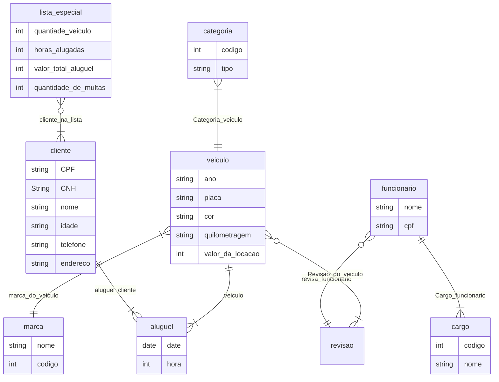

```mermaid
erDiagram
    veiculo{
        string ano
        string placa
        string cor
        string quilometragem
        int valor_da_locacao
    }
    categoria{
        int codigo
        string tipo
    }
    marca{
        string nome
        int codigo
    }
    cliente{
        string CPF
        String CNH
        string nome
        string idade
        string telefone
        string endereco
    }
    aluguel{
        date date
        int hora
    }

    funcionario{
        string nome
        string cpf
    }
    cargo{
        int codigo
        string nome
    }
    revisao{

    }
    lista_especial{
        int quantiade_veiculo
        int horas_alugadas
        int valor_total_aluguel
        int quantidade_de_multas
    }
        veiculo}|--|| marca:marca_do_veiculo
    cliente||--|{ aluguel:aluguel_cliente
    veiculo||--|{aluguel:veiculo
    categoria}|--||veiculo:Categoria_veiculo
    funcionario||--|{ cargo:Cargo_funcionario
    funcionario}o--||revisao:revisa_funcionario
    veiculo}o--|{revisao:Revisao_do_veiculo
    lista_especial}o--|{cliente:cliente_na_lista
```
