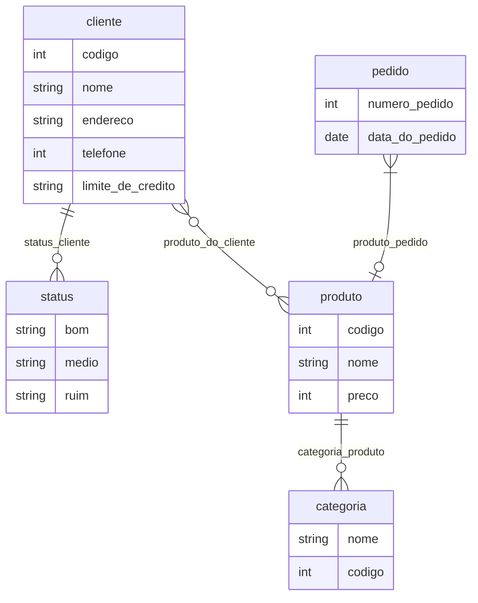

```mermaid
erDiagram

produto{
    int codigo
    string nome
    int preco
}
cliente{
    int codigo
    string nome
    string endereco
    int telefone
    string limite_de_credito
}

status{
    string bom
    string medio
    string ruim
}

pedido{
    int numero_pedido
    date data_do_pedido
}

categoria{
    string nome
    int codigo
}
produto||--o{categoria:categoria_produto
cliente||--o{status:status_cliente
cliente}o--o{produto:produto_do_cliente
%%n entendi a relação de pedido e produto
pedido}|--o|produto:produto_pedido

```
