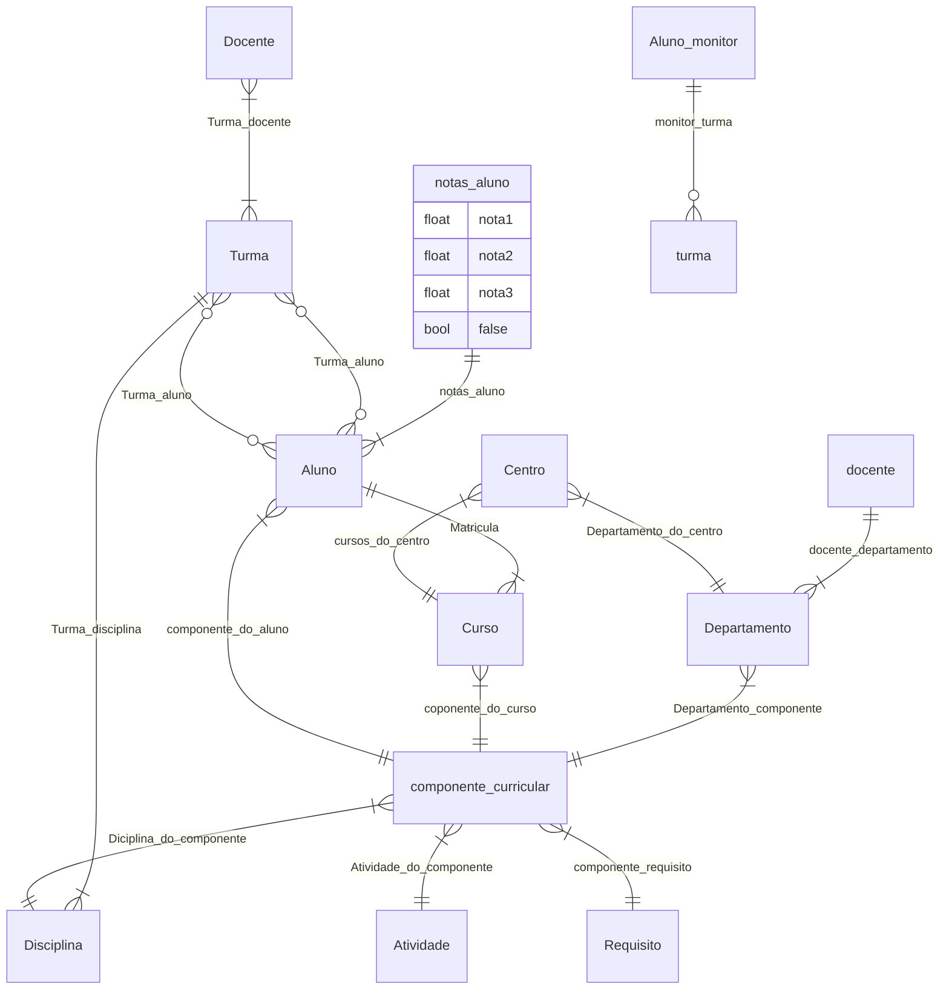

```mermaid
erDiagram
%%%caso for vários centros é de muito para muitos
    notas_aluno{
    float nota1
    float nota2
    float nota3
    bool false
    }
    Centro }|--|| Curso : cursos_do_centro
    Centro }|--|| Departamento : Departamento_do_centro
    Aluno ||--|{ Curso: Matricula
    Aluno }|--|| componente_curricular:componente_do_aluno
    Curso }|--|| componente_curricular:coponente_do_curso
    componente_curricular}|--||Disciplina:Diciplina_do_componente
    componente_curricular}|--||Atividade:Atividade_do_componente
    componente_curricular}|--||Requisito:componente_requisito
    Departamento}|--||componente_curricular:Departamento_componente
    Docente}|--|{Turma:Turma_docente
    Turma}o--o{Aluno:Turma_aluno
    Turma||--|{Disciplina:Turma_disciplina
    Turma}o--o{Aluno:Turma_aluno
    Aluno_monitor||--o{turma:monitor_turma
    docente||--|{Departamento:docente_departamento
    notas_aluno||--|{Aluno:notas_aluno
```
